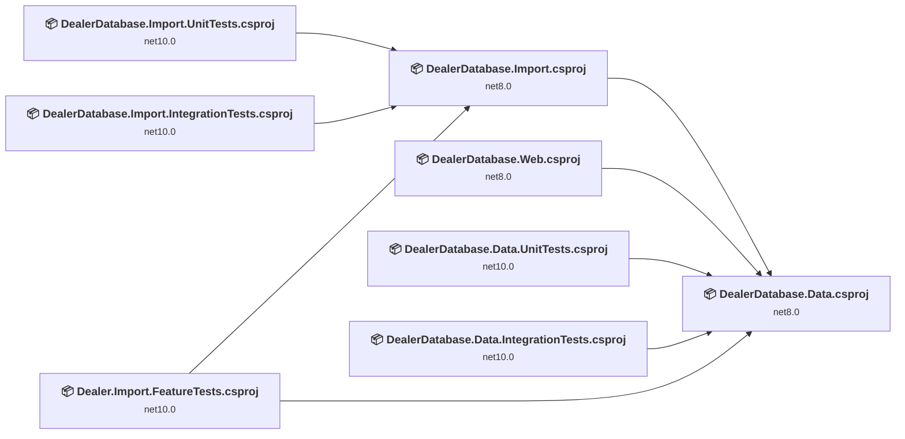
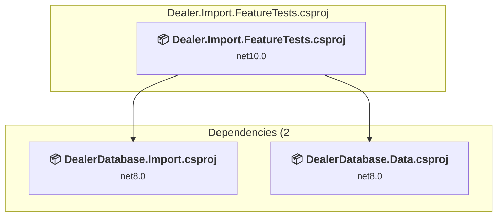
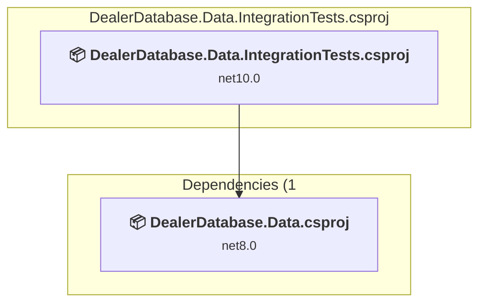
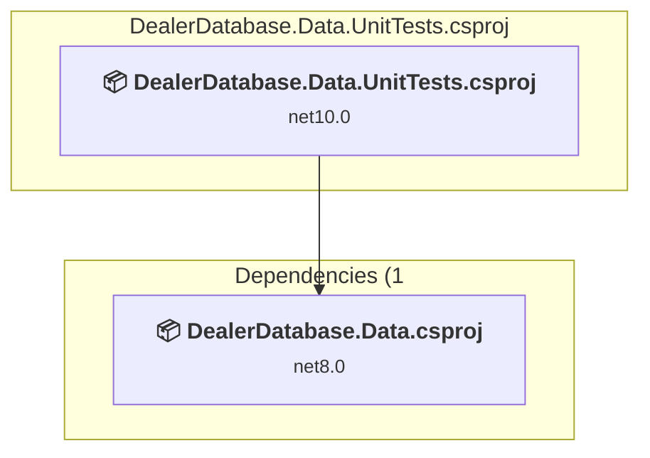
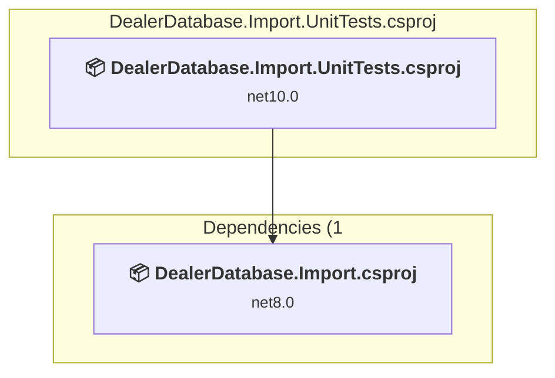
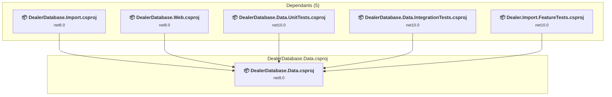
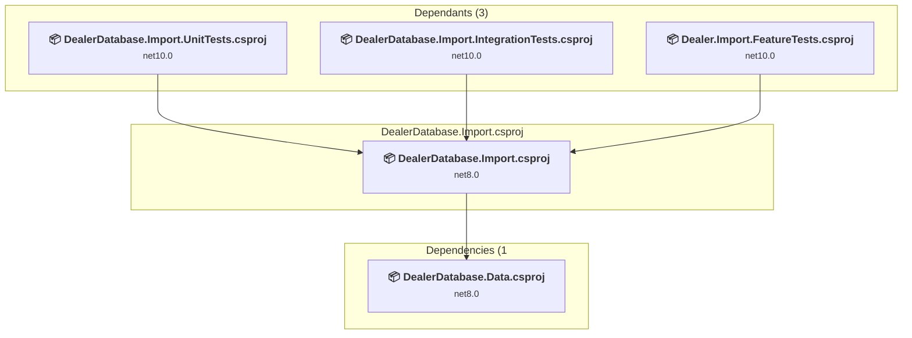
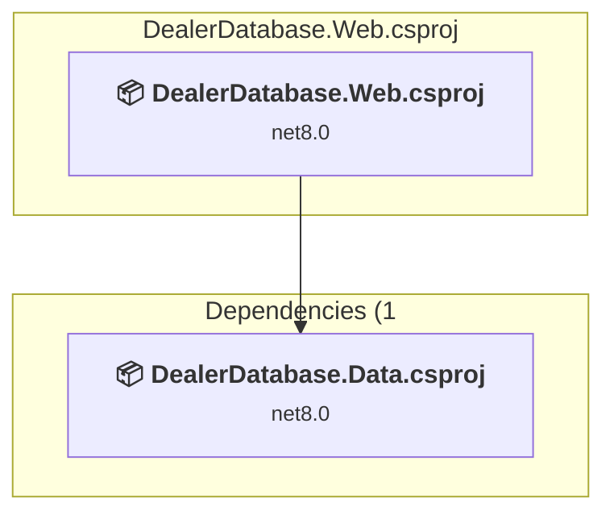

# Projects and dependencies analysis

This document provides a comprehensive overview of the projects and their dependencies in the context of upgrading to .NETCoreApp,Version=v8.0.

## Table of Contents

- [Executive Summary](#executive-Summary)
  - [Highlevel Metrics](#highlevel-metrics)
  - [Projects Compatibility](#projects-compatibility)
  - [Package Compatibility](#package-compatibility)
  - [API Compatibility](#api-compatibility)
  - [Binding Redirect Configuration](#binding-redirect-configuration)
- [Aggregate NuGet packages details](#aggregate-nuget-packages-details)
- [Top API Migration Challenges](#top-api-migration-challenges)
  - [Technologies and Features](#technologies-and-features)
  - [Most Frequent API Issues](#most-frequent-api-issues)
- [Projects Relationship Graph](#projects-relationship-graph)
- [Project Details](#project-details)

  - [Dealer.Import.FeatureTests\Dealer.Import.FeatureTests.csproj](#dealerimportfeaturetestsdealerimportfeaturetestscsproj)
  - [DealerDatabase.Data.IntegrationTests.cs\DealerDatabase.Data.IntegrationTests.csproj](#dealerdatabasedataintegrationtestscsdealerdatabasedataintegrationtestscsproj)
  - [DealerDatabase.Data.Tests\DealerDatabase.Data.UnitTests.csproj](#dealerdatabasedatatestsdealerdatabasedataunittestscsproj)
  - [DealerDatabase.Import.IntegrationTests\DealerDatabase.Import.IntegrationTests.csproj](#dealerdatabaseimportintegrationtestsdealerdatabaseimportintegrationtestscsproj)
  - [DealerDatabase.Import.Tests\DealerDatabase.Import.UnitTests.csproj](#dealerdatabaseimporttestsdealerdatabaseimportunittestscsproj)
  - [src\DealerDatabase.Data\DealerDatabase.Data.csproj](#srcdealerdatabasedatadealerdatabasedatacsproj)
  - [src\DealerDatabase.Import\DealerDatabase.Import.csproj](#srcdealerdatabaseimportdealerdatabaseimportcsproj)
  - [src\DealerDatabase.Web\DealerDatabase.Web.csproj](#srcdealerdatabasewebdealerdatabasewebcsproj)

## Executive Summary

### Highlevel Metrics

| Metric | Count | Status |
| :--- | :---: | :--- |
| Total Projects | 8 | 0 require upgrade |
| Total NuGet Packages | 79 | All compatible |
| Total Code Files | 50 |  |
| Total Code Files with Incidents | 0 |  |
| Total Lines of Code | 4325 |  |
| Total Number of Issues | 0 |  |
| Estimated LOC to modify | 0+ | at least 0.0% of codebase |

### Projects Compatibility

| Project | Target Framework | Difficulty | Package Issues | API Issues | Binding Issues | Est. LOC Impact | Description |
| :--- | :---: | :---: | :---: | :---: | :---: | :---: | :--- |
| [Dealer.Import.FeatureTests\Dealer.Import.FeatureTests.csproj](#dealerimportfeaturetestsdealerimportfeaturetestscsproj) | net10.0 | ✅ None | 0 | 0 | 0 |  | DotNetCoreApp, Sdk Style = True |
| [DealerDatabase.Data.IntegrationTests.cs\DealerDatabase.Data.IntegrationTests.csproj](#dealerdatabasedataintegrationtestscsdealerdatabasedataintegrationtestscsproj) | net10.0 | ✅ None | 0 | 0 | 0 |  | DotNetCoreApp, Sdk Style = True |
| [DealerDatabase.Data.Tests\DealerDatabase.Data.UnitTests.csproj](#dealerdatabasedatatestsdealerdatabasedataunittestscsproj) | net10.0 | ✅ None | 0 | 0 | 0 |  | DotNetCoreApp, Sdk Style = True |
| [DealerDatabase.Import.IntegrationTests\DealerDatabase.Import.IntegrationTests.csproj](#dealerdatabaseimportintegrationtestsdealerdatabaseimportintegrationtestscsproj) | net10.0 | ✅ None | 0 | 0 | 0 |  | DotNetCoreApp, Sdk Style = True |
| [DealerDatabase.Import.Tests\DealerDatabase.Import.UnitTests.csproj](#dealerdatabaseimporttestsdealerdatabaseimportunittestscsproj) | net10.0 | ✅ None | 0 | 0 | 0 |  | DotNetCoreApp, Sdk Style = True |
| [src\DealerDatabase.Data\DealerDatabase.Data.csproj](#srcdealerdatabasedatadealerdatabasedatacsproj) | net8.0 | ✅ None | 0 | 0 | 0 |  | ClassLibrary, Sdk Style = True |
| [src\DealerDatabase.Import\DealerDatabase.Import.csproj](#srcdealerdatabaseimportdealerdatabaseimportcsproj) | net8.0 | ✅ None | 0 | 0 | 0 |  | DotNetCoreApp, Sdk Style = True |
| [src\DealerDatabase.Web\DealerDatabase.Web.csproj](#srcdealerdatabasewebdealerdatabasewebcsproj) | net8.0 | ✅ None | 0 | 0 | 0 |  | AspNetCore, Sdk Style = True |

### Package Compatibility

| Status | Count | Percentage |
| :--- | :---: | :---: |
| ✅ Compatible | 79 | 100.0% |
| ⚠️ Incompatible | 0 | 0.0% |
| 🔄 Upgrade Recommended | 0 | 0.0% |
| ***Total NuGet Packages*** | ***79*** | ***100%*** |

### API Compatibility

| Category | Count | Impact |
| :--- | :---: | :--- |
| 🔴 Binary Incompatible | 0 | High - Require code changes |
| 🟡 Source Incompatible | 0 | Medium - Needs re-compilation and potential conflicting API error fixing |
| 🔵 Behavioral change | 0 | Low - Behavioral changes that may require testing at runtime |
| ✅ Compatible | 0 |  |
| ***Total APIs Analyzed*** | ***0*** |  |

## Aggregate NuGet packages details

| Package | Current Version | Suggested Version | Projects | Description |
| :--- | :---: | :---: | :--- | :--- |
| Humanizer.Core | 2.14.1 |  | [DealerDatabase.Data.csproj](#srcdealerdatabasedatadealerdatabasedatacsproj) | ✅Compatible |
| Microsoft.ApplicationInsights | 2.22.0 |  | [Dealer.Import.FeatureTests.csproj](#dealerimportfeaturetestsdealerimportfeaturetestscsproj) [DealerDatabase.Data.IntegrationTests.csproj](#dealerdatabasedataintegrationtestscsdealerdatabasedataintegrationtestscsproj) [DealerDatabase.Data.UnitTests.csproj](#dealerdatabasedatatestsdealerdatabasedataunittestscsproj) [DealerDatabase.Import.IntegrationTests.csproj](#dealerdatabaseimportintegrationtestsdealerdatabaseimportintegrationtestscsproj) [DealerDatabase.Import.UnitTests.csproj](#dealerdatabaseimporttestsdealerdatabaseimportunittestscsproj) | ✅Compatible |
| Microsoft.Bcl.AsyncInterfaces | 6.0.0 |  | [DealerDatabase.Data.csproj](#srcdealerdatabasedatadealerdatabasedatacsproj) | ✅Compatible |
| Microsoft.CodeAnalysis.Analyzers | 3.3.3 |  | [DealerDatabase.Data.csproj](#srcdealerdatabasedatadealerdatabasedatacsproj) | ✅Compatible |
| Microsoft.CodeAnalysis.Common | 4.5.0 |  | [DealerDatabase.Data.csproj](#srcdealerdatabasedatadealerdatabasedatacsproj) | ✅Compatible |
| Microsoft.CodeAnalysis.CSharp | 4.5.0 |  | [DealerDatabase.Data.csproj](#srcdealerdatabasedatadealerdatabasedatacsproj) | ✅Compatible |
| Microsoft.CodeAnalysis.CSharp.Workspaces | 4.5.0 |  | [DealerDatabase.Data.csproj](#srcdealerdatabasedatadealerdatabasedatacsproj) | ✅Compatible |
| Microsoft.CodeAnalysis.Workspaces.Common | 4.5.0 |  | [DealerDatabase.Data.csproj](#srcdealerdatabasedatadealerdatabasedatacsproj) | ✅Compatible |
| Microsoft.CodeCoverage | 18.5.0 |  | [Dealer.Import.FeatureTests.csproj](#dealerimportfeaturetestsdealerimportfeaturetestscsproj) [DealerDatabase.Data.IntegrationTests.csproj](#dealerdatabasedataintegrationtestscsdealerdatabasedataintegrationtestscsproj) [DealerDatabase.Data.UnitTests.csproj](#dealerdatabasedatatestsdealerdatabasedataunittestscsproj) [DealerDatabase.Import.IntegrationTests.csproj](#dealerdatabaseimportintegrationtestsdealerdatabaseimportintegrationtestscsproj) [DealerDatabase.Import.UnitTests.csproj](#dealerdatabaseimporttestsdealerdatabaseimportunittestscsproj) | ✅Compatible |
| Microsoft.Data.Sqlite.Core | 8.0.20 |  | [Dealer.Import.FeatureTests.csproj](#dealerimportfeaturetestsdealerimportfeaturetestscsproj) [DealerDatabase.Data.csproj](#srcdealerdatabasedatadealerdatabasedatacsproj) [DealerDatabase.Data.IntegrationTests.csproj](#dealerdatabasedataintegrationtestscsdealerdatabasedataintegrationtestscsproj) [DealerDatabase.Data.UnitTests.csproj](#dealerdatabasedatatestsdealerdatabasedataunittestscsproj) [DealerDatabase.Import.csproj](#srcdealerdatabaseimportdealerdatabaseimportcsproj) [DealerDatabase.Import.IntegrationTests.csproj](#dealerdatabaseimportintegrationtestsdealerdatabaseimportintegrationtestscsproj) [DealerDatabase.Import.UnitTests.csproj](#dealerdatabaseimporttestsdealerdatabaseimportunittestscsproj) [DealerDatabase.Web.csproj](#srcdealerdatabasewebdealerdatabasewebcsproj) | ✅Compatible |
| Microsoft.EntityFrameworkCore | 8.0.20 |  | [Dealer.Import.FeatureTests.csproj](#dealerimportfeaturetestsdealerimportfeaturetestscsproj) [DealerDatabase.Data.csproj](#srcdealerdatabasedatadealerdatabasedatacsproj) [DealerDatabase.Data.IntegrationTests.csproj](#dealerdatabasedataintegrationtestscsdealerdatabasedataintegrationtestscsproj) [DealerDatabase.Data.UnitTests.csproj](#dealerdatabasedatatestsdealerdatabasedataunittestscsproj) [DealerDatabase.Import.csproj](#srcdealerdatabaseimportdealerdatabaseimportcsproj) [DealerDatabase.Import.IntegrationTests.csproj](#dealerdatabaseimportintegrationtestsdealerdatabaseimportintegrationtestscsproj) [DealerDatabase.Import.UnitTests.csproj](#dealerdatabaseimporttestsdealerdatabaseimportunittestscsproj) [DealerDatabase.Web.csproj](#srcdealerdatabasewebdealerdatabasewebcsproj) | ✅Compatible |
| Microsoft.EntityFrameworkCore.Abstractions | 8.0.20 |  | [Dealer.Import.FeatureTests.csproj](#dealerimportfeaturetestsdealerimportfeaturetestscsproj) [DealerDatabase.Data.csproj](#srcdealerdatabasedatadealerdatabasedatacsproj) [DealerDatabase.Data.IntegrationTests.csproj](#dealerdatabasedataintegrationtestscsdealerdatabasedataintegrationtestscsproj) [DealerDatabase.Data.UnitTests.csproj](#dealerdatabasedatatestsdealerdatabasedataunittestscsproj) [DealerDatabase.Import.csproj](#srcdealerdatabaseimportdealerdatabaseimportcsproj) [DealerDatabase.Import.IntegrationTests.csproj](#dealerdatabaseimportintegrationtestsdealerdatabaseimportintegrationtestscsproj) [DealerDatabase.Import.UnitTests.csproj](#dealerdatabaseimporttestsdealerdatabaseimportunittestscsproj) [DealerDatabase.Web.csproj](#srcdealerdatabasewebdealerdatabasewebcsproj) | ✅Compatible |
| Microsoft.EntityFrameworkCore.Analyzers | 8.0.20 |  | [Dealer.Import.FeatureTests.csproj](#dealerimportfeaturetestsdealerimportfeaturetestscsproj) [DealerDatabase.Data.csproj](#srcdealerdatabasedatadealerdatabasedatacsproj) [DealerDatabase.Data.IntegrationTests.csproj](#dealerdatabasedataintegrationtestscsdealerdatabasedataintegrationtestscsproj) [DealerDatabase.Data.UnitTests.csproj](#dealerdatabasedatatestsdealerdatabasedataunittestscsproj) [DealerDatabase.Import.csproj](#srcdealerdatabaseimportdealerdatabaseimportcsproj) [DealerDatabase.Import.IntegrationTests.csproj](#dealerdatabaseimportintegrationtestsdealerdatabaseimportintegrationtestscsproj) [DealerDatabase.Import.UnitTests.csproj](#dealerdatabaseimporttestsdealerdatabaseimportunittestscsproj) [DealerDatabase.Web.csproj](#srcdealerdatabasewebdealerdatabasewebcsproj) | ✅Compatible |
| Microsoft.EntityFrameworkCore.Design | 8.0.20 |  | [DealerDatabase.Data.csproj](#srcdealerdatabasedatadealerdatabasedatacsproj) | ✅Compatible |
| Microsoft.EntityFrameworkCore.Relational | 8.0.20 |  | [Dealer.Import.FeatureTests.csproj](#dealerimportfeaturetestsdealerimportfeaturetestscsproj) [DealerDatabase.Data.csproj](#srcdealerdatabasedatadealerdatabasedatacsproj) [DealerDatabase.Data.IntegrationTests.csproj](#dealerdatabasedataintegrationtestscsdealerdatabasedataintegrationtestscsproj) [DealerDatabase.Data.UnitTests.csproj](#dealerdatabasedatatestsdealerdatabasedataunittestscsproj) [DealerDatabase.Import.csproj](#srcdealerdatabaseimportdealerdatabaseimportcsproj) [DealerDatabase.Import.IntegrationTests.csproj](#dealerdatabaseimportintegrationtestsdealerdatabaseimportintegrationtestscsproj) [DealerDatabase.Import.UnitTests.csproj](#dealerdatabaseimporttestsdealerdatabaseimportunittestscsproj) [DealerDatabase.Web.csproj](#srcdealerdatabasewebdealerdatabasewebcsproj) | ✅Compatible |
| Microsoft.EntityFrameworkCore.Sqlite | 8.0.20 |  | [Dealer.Import.FeatureTests.csproj](#dealerimportfeaturetestsdealerimportfeaturetestscsproj) [DealerDatabase.Data.csproj](#srcdealerdatabasedatadealerdatabasedatacsproj) [DealerDatabase.Data.IntegrationTests.csproj](#dealerdatabasedataintegrationtestscsdealerdatabasedataintegrationtestscsproj) [DealerDatabase.Data.UnitTests.csproj](#dealerdatabasedatatestsdealerdatabasedataunittestscsproj) [DealerDatabase.Import.csproj](#srcdealerdatabaseimportdealerdatabaseimportcsproj) [DealerDatabase.Import.IntegrationTests.csproj](#dealerdatabaseimportintegrationtestsdealerdatabaseimportintegrationtestscsproj) [DealerDatabase.Import.UnitTests.csproj](#dealerdatabaseimporttestsdealerdatabaseimportunittestscsproj) [DealerDatabase.Web.csproj](#srcdealerdatabasewebdealerdatabasewebcsproj) | ✅Compatible |
| Microsoft.EntityFrameworkCore.Sqlite.Core | 8.0.20 |  | [Dealer.Import.FeatureTests.csproj](#dealerimportfeaturetestsdealerimportfeaturetestscsproj) [DealerDatabase.Data.csproj](#srcdealerdatabasedatadealerdatabasedatacsproj) [DealerDatabase.Data.IntegrationTests.csproj](#dealerdatabasedataintegrationtestscsdealerdatabasedataintegrationtestscsproj) [DealerDatabase.Data.UnitTests.csproj](#dealerdatabasedatatestsdealerdatabasedataunittestscsproj) [DealerDatabase.Import.csproj](#srcdealerdatabaseimportdealerdatabaseimportcsproj) [DealerDatabase.Import.IntegrationTests.csproj](#dealerdatabaseimportintegrationtestsdealerdatabaseimportintegrationtestscsproj) [DealerDatabase.Import.UnitTests.csproj](#dealerdatabaseimporttestsdealerdatabaseimportunittestscsproj) [DealerDatabase.Web.csproj](#srcdealerdatabasewebdealerdatabasewebcsproj) | ✅Compatible |
| Microsoft.Extensions.Caching.Abstractions | 8.0.0 |  | [Dealer.Import.FeatureTests.csproj](#dealerimportfeaturetestsdealerimportfeaturetestscsproj) [DealerDatabase.Data.csproj](#srcdealerdatabasedatadealerdatabasedatacsproj) [DealerDatabase.Data.IntegrationTests.csproj](#dealerdatabasedataintegrationtestscsdealerdatabasedataintegrationtestscsproj) [DealerDatabase.Data.UnitTests.csproj](#dealerdatabasedatatestsdealerdatabasedataunittestscsproj) [DealerDatabase.Import.csproj](#srcdealerdatabaseimportdealerdatabaseimportcsproj) [DealerDatabase.Import.IntegrationTests.csproj](#dealerdatabaseimportintegrationtestsdealerdatabaseimportintegrationtestscsproj) [DealerDatabase.Import.UnitTests.csproj](#dealerdatabaseimporttestsdealerdatabaseimportunittestscsproj) [DealerDatabase.Web.csproj](#srcdealerdatabasewebdealerdatabasewebcsproj) | ✅Compatible |
| Microsoft.Extensions.Caching.Memory | 8.0.1 |  | [Dealer.Import.FeatureTests.csproj](#dealerimportfeaturetestsdealerimportfeaturetestscsproj) [DealerDatabase.Data.csproj](#srcdealerdatabasedatadealerdatabasedatacsproj) [DealerDatabase.Data.IntegrationTests.csproj](#dealerdatabasedataintegrationtestscsdealerdatabasedataintegrationtestscsproj) [DealerDatabase.Data.UnitTests.csproj](#dealerdatabasedatatestsdealerdatabasedataunittestscsproj) [DealerDatabase.Import.csproj](#srcdealerdatabaseimportdealerdatabaseimportcsproj) [DealerDatabase.Import.IntegrationTests.csproj](#dealerdatabaseimportintegrationtestsdealerdatabaseimportintegrationtestscsproj) [DealerDatabase.Import.UnitTests.csproj](#dealerdatabaseimporttestsdealerdatabaseimportunittestscsproj) [DealerDatabase.Web.csproj](#srcdealerdatabasewebdealerdatabasewebcsproj) | ✅Compatible |
| Microsoft.Extensions.Configuration | 8.0.0 |  | [Dealer.Import.FeatureTests.csproj](#dealerimportfeaturetestsdealerimportfeaturetestscsproj) [DealerDatabase.Import.csproj](#srcdealerdatabaseimportdealerdatabaseimportcsproj) [DealerDatabase.Import.IntegrationTests.csproj](#dealerdatabaseimportintegrationtestsdealerdatabaseimportintegrationtestscsproj) [DealerDatabase.Import.UnitTests.csproj](#dealerdatabaseimporttestsdealerdatabaseimportunittestscsproj) | ✅Compatible |
| Microsoft.Extensions.Configuration.Abstractions | 8.0.0 |  | [Dealer.Import.FeatureTests.csproj](#dealerimportfeaturetestsdealerimportfeaturetestscsproj) [DealerDatabase.Data.csproj](#srcdealerdatabasedatadealerdatabasedatacsproj) [DealerDatabase.Data.IntegrationTests.csproj](#dealerdatabasedataintegrationtestscsdealerdatabasedataintegrationtestscsproj) [DealerDatabase.Data.UnitTests.csproj](#dealerdatabasedatatestsdealerdatabasedataunittestscsproj) [DealerDatabase.Import.csproj](#srcdealerdatabaseimportdealerdatabaseimportcsproj) [DealerDatabase.Import.IntegrationTests.csproj](#dealerdatabaseimportintegrationtestsdealerdatabaseimportintegrationtestscsproj) [DealerDatabase.Import.UnitTests.csproj](#dealerdatabaseimporttestsdealerdatabaseimportunittestscsproj) [DealerDatabase.Web.csproj](#srcdealerdatabasewebdealerdatabasewebcsproj) | ✅Compatible |
| Microsoft.Extensions.Configuration.Binder | 8.0.2 |  | [Dealer.Import.FeatureTests.csproj](#dealerimportfeaturetestsdealerimportfeaturetestscsproj) [DealerDatabase.Import.csproj](#srcdealerdatabaseimportdealerdatabaseimportcsproj) [DealerDatabase.Import.IntegrationTests.csproj](#dealerdatabaseimportintegrationtestsdealerdatabaseimportintegrationtestscsproj) [DealerDatabase.Import.UnitTests.csproj](#dealerdatabaseimporttestsdealerdatabaseimportunittestscsproj) | ✅Compatible |
| Microsoft.Extensions.Configuration.CommandLine | 8.0.0 |  | [Dealer.Import.FeatureTests.csproj](#dealerimportfeaturetestsdealerimportfeaturetestscsproj) [DealerDatabase.Import.csproj](#srcdealerdatabaseimportdealerdatabaseimportcsproj) [DealerDatabase.Import.IntegrationTests.csproj](#dealerdatabaseimportintegrationtestsdealerdatabaseimportintegrationtestscsproj) [DealerDatabase.Import.UnitTests.csproj](#dealerdatabaseimporttestsdealerdatabaseimportunittestscsproj) | ✅Compatible |
| Microsoft.Extensions.Configuration.EnvironmentVariables | 8.0.0 |  | [Dealer.Import.FeatureTests.csproj](#dealerimportfeaturetestsdealerimportfeaturetestscsproj) [DealerDatabase.Import.csproj](#srcdealerdatabaseimportdealerdatabaseimportcsproj) [DealerDatabase.Import.IntegrationTests.csproj](#dealerdatabaseimportintegrationtestsdealerdatabaseimportintegrationtestscsproj) [DealerDatabase.Import.UnitTests.csproj](#dealerdatabaseimporttestsdealerdatabaseimportunittestscsproj) | ✅Compatible |
| Microsoft.Extensions.Configuration.FileExtensions | 8.0.1 |  | [Dealer.Import.FeatureTests.csproj](#dealerimportfeaturetestsdealerimportfeaturetestscsproj) [DealerDatabase.Import.csproj](#srcdealerdatabaseimportdealerdatabaseimportcsproj) [DealerDatabase.Import.IntegrationTests.csproj](#dealerdatabaseimportintegrationtestsdealerdatabaseimportintegrationtestscsproj) [DealerDatabase.Import.UnitTests.csproj](#dealerdatabaseimporttestsdealerdatabaseimportunittestscsproj) | ✅Compatible |
| Microsoft.Extensions.Configuration.Json | 8.0.1 |  | [Dealer.Import.FeatureTests.csproj](#dealerimportfeaturetestsdealerimportfeaturetestscsproj) [DealerDatabase.Import.csproj](#srcdealerdatabaseimportdealerdatabaseimportcsproj) [DealerDatabase.Import.IntegrationTests.csproj](#dealerdatabaseimportintegrationtestsdealerdatabaseimportintegrationtestscsproj) [DealerDatabase.Import.UnitTests.csproj](#dealerdatabaseimporttestsdealerdatabaseimportunittestscsproj) | ✅Compatible |
| Microsoft.Extensions.Configuration.UserSecrets | 8.0.1 |  | [Dealer.Import.FeatureTests.csproj](#dealerimportfeaturetestsdealerimportfeaturetestscsproj) [DealerDatabase.Import.csproj](#srcdealerdatabaseimportdealerdatabaseimportcsproj) [DealerDatabase.Import.IntegrationTests.csproj](#dealerdatabaseimportintegrationtestsdealerdatabaseimportintegrationtestscsproj) [DealerDatabase.Import.UnitTests.csproj](#dealerdatabaseimporttestsdealerdatabaseimportunittestscsproj) | ✅Compatible |
| Microsoft.Extensions.DependencyInjection | 8.0.1 |  | [Dealer.Import.FeatureTests.csproj](#dealerimportfeaturetestsdealerimportfeaturetestscsproj) [DealerDatabase.Data.csproj](#srcdealerdatabasedatadealerdatabasedatacsproj) [DealerDatabase.Data.IntegrationTests.csproj](#dealerdatabasedataintegrationtestscsdealerdatabasedataintegrationtestscsproj) [DealerDatabase.Data.UnitTests.csproj](#dealerdatabasedatatestsdealerdatabasedataunittestscsproj) [DealerDatabase.Import.csproj](#srcdealerdatabaseimportdealerdatabaseimportcsproj) [DealerDatabase.Import.IntegrationTests.csproj](#dealerdatabaseimportintegrationtestsdealerdatabaseimportintegrationtestscsproj) [DealerDatabase.Import.UnitTests.csproj](#dealerdatabaseimporttestsdealerdatabaseimportunittestscsproj) [DealerDatabase.Web.csproj](#srcdealerdatabasewebdealerdatabasewebcsproj) | ✅Compatible |
| Microsoft.Extensions.DependencyInjection.Abstractions | 8.0.2 |  | [Dealer.Import.FeatureTests.csproj](#dealerimportfeaturetestsdealerimportfeaturetestscsproj) [DealerDatabase.Data.csproj](#srcdealerdatabasedatadealerdatabasedatacsproj) [DealerDatabase.Data.IntegrationTests.csproj](#dealerdatabasedataintegrationtestscsdealerdatabasedataintegrationtestscsproj) [DealerDatabase.Data.UnitTests.csproj](#dealerdatabasedatatestsdealerdatabasedataunittestscsproj) [DealerDatabase.Import.csproj](#srcdealerdatabaseimportdealerdatabaseimportcsproj) [DealerDatabase.Import.IntegrationTests.csproj](#dealerdatabaseimportintegrationtestsdealerdatabaseimportintegrationtestscsproj) [DealerDatabase.Import.UnitTests.csproj](#dealerdatabaseimporttestsdealerdatabaseimportunittestscsproj) [DealerDatabase.Web.csproj](#srcdealerdatabasewebdealerdatabasewebcsproj) | ✅Compatible |
| Microsoft.Extensions.DependencyModel | 8.0.2 |  | [Dealer.Import.FeatureTests.csproj](#dealerimportfeaturetestsdealerimportfeaturetestscsproj) [DealerDatabase.Data.csproj](#srcdealerdatabasedatadealerdatabasedatacsproj) [DealerDatabase.Data.IntegrationTests.csproj](#dealerdatabasedataintegrationtestscsdealerdatabasedataintegrationtestscsproj) [DealerDatabase.Data.UnitTests.csproj](#dealerdatabasedatatestsdealerdatabasedataunittestscsproj) [DealerDatabase.Import.csproj](#srcdealerdatabaseimportdealerdatabaseimportcsproj) [DealerDatabase.Import.IntegrationTests.csproj](#dealerdatabaseimportintegrationtestsdealerdatabaseimportintegrationtestscsproj) [DealerDatabase.Import.UnitTests.csproj](#dealerdatabaseimporttestsdealerdatabaseimportunittestscsproj) [DealerDatabase.Web.csproj](#srcdealerdatabasewebdealerdatabasewebcsproj) | ✅Compatible |
| Microsoft.Extensions.Diagnostics | 8.0.1 |  | [Dealer.Import.FeatureTests.csproj](#dealerimportfeaturetestsdealerimportfeaturetestscsproj) [DealerDatabase.Import.csproj](#srcdealerdatabaseimportdealerdatabaseimportcsproj) [DealerDatabase.Import.IntegrationTests.csproj](#dealerdatabaseimportintegrationtestsdealerdatabaseimportintegrationtestscsproj) [DealerDatabase.Import.UnitTests.csproj](#dealerdatabaseimporttestsdealerdatabaseimportunittestscsproj) | ✅Compatible |
| Microsoft.Extensions.Diagnostics.Abstractions | 8.0.1 |  | [Dealer.Import.FeatureTests.csproj](#dealerimportfeaturetestsdealerimportfeaturetestscsproj) [DealerDatabase.Import.csproj](#srcdealerdatabaseimportdealerdatabaseimportcsproj) [DealerDatabase.Import.IntegrationTests.csproj](#dealerdatabaseimportintegrationtestsdealerdatabaseimportintegrationtestscsproj) [DealerDatabase.Import.UnitTests.csproj](#dealerdatabaseimporttestsdealerdatabaseimportunittestscsproj) | ✅Compatible |
| Microsoft.Extensions.FileProviders.Abstractions | 8.0.0 |  | [Dealer.Import.FeatureTests.csproj](#dealerimportfeaturetestsdealerimportfeaturetestscsproj) [DealerDatabase.Import.csproj](#srcdealerdatabaseimportdealerdatabaseimportcsproj) [DealerDatabase.Import.IntegrationTests.csproj](#dealerdatabaseimportintegrationtestsdealerdatabaseimportintegrationtestscsproj) [DealerDatabase.Import.UnitTests.csproj](#dealerdatabaseimporttestsdealerdatabaseimportunittestscsproj) | ✅Compatible |
| Microsoft.Extensions.FileProviders.Physical | 8.0.0 |  | [Dealer.Import.FeatureTests.csproj](#dealerimportfeaturetestsdealerimportfeaturetestscsproj) [DealerDatabase.Import.csproj](#srcdealerdatabaseimportdealerdatabaseimportcsproj) [DealerDatabase.Import.IntegrationTests.csproj](#dealerdatabaseimportintegrationtestsdealerdatabaseimportintegrationtestscsproj) [DealerDatabase.Import.UnitTests.csproj](#dealerdatabaseimporttestsdealerdatabaseimportunittestscsproj) | ✅Compatible |
| Microsoft.Extensions.FileSystemGlobbing | 8.0.0 |  | [Dealer.Import.FeatureTests.csproj](#dealerimportfeaturetestsdealerimportfeaturetestscsproj) [DealerDatabase.Import.csproj](#srcdealerdatabaseimportdealerdatabaseimportcsproj) [DealerDatabase.Import.IntegrationTests.csproj](#dealerdatabaseimportintegrationtestsdealerdatabaseimportintegrationtestscsproj) [DealerDatabase.Import.UnitTests.csproj](#dealerdatabaseimporttestsdealerdatabaseimportunittestscsproj) | ✅Compatible |
| Microsoft.Extensions.Hosting | 8.0.1 |  | [Dealer.Import.FeatureTests.csproj](#dealerimportfeaturetestsdealerimportfeaturetestscsproj) [DealerDatabase.Import.csproj](#srcdealerdatabaseimportdealerdatabaseimportcsproj) [DealerDatabase.Import.IntegrationTests.csproj](#dealerdatabaseimportintegrationtestsdealerdatabaseimportintegrationtestscsproj) [DealerDatabase.Import.UnitTests.csproj](#dealerdatabaseimporttestsdealerdatabaseimportunittestscsproj) | ✅Compatible |
| Microsoft.Extensions.Hosting.Abstractions | 8.0.1 |  | [Dealer.Import.FeatureTests.csproj](#dealerimportfeaturetestsdealerimportfeaturetestscsproj) [DealerDatabase.Import.csproj](#srcdealerdatabaseimportdealerdatabaseimportcsproj) [DealerDatabase.Import.IntegrationTests.csproj](#dealerdatabaseimportintegrationtestsdealerdatabaseimportintegrationtestscsproj) [DealerDatabase.Import.UnitTests.csproj](#dealerdatabaseimporttestsdealerdatabaseimportunittestscsproj) | ✅Compatible |
| Microsoft.Extensions.Logging | 8.0.1 |  | [Dealer.Import.FeatureTests.csproj](#dealerimportfeaturetestsdealerimportfeaturetestscsproj) [DealerDatabase.Data.csproj](#srcdealerdatabasedatadealerdatabasedatacsproj) [DealerDatabase.Data.IntegrationTests.csproj](#dealerdatabasedataintegrationtestscsdealerdatabasedataintegrationtestscsproj) [DealerDatabase.Data.UnitTests.csproj](#dealerdatabasedatatestsdealerdatabasedataunittestscsproj) [DealerDatabase.Import.csproj](#srcdealerdatabaseimportdealerdatabaseimportcsproj) [DealerDatabase.Import.IntegrationTests.csproj](#dealerdatabaseimportintegrationtestsdealerdatabaseimportintegrationtestscsproj) [DealerDatabase.Import.UnitTests.csproj](#dealerdatabaseimporttestsdealerdatabaseimportunittestscsproj) [DealerDatabase.Web.csproj](#srcdealerdatabasewebdealerdatabasewebcsproj) | ✅Compatible |
| Microsoft.Extensions.Logging.Abstractions | 8.0.2 |  | [Dealer.Import.FeatureTests.csproj](#dealerimportfeaturetestsdealerimportfeaturetestscsproj) [DealerDatabase.Data.csproj](#srcdealerdatabasedatadealerdatabasedatacsproj) [DealerDatabase.Data.IntegrationTests.csproj](#dealerdatabasedataintegrationtestscsdealerdatabasedataintegrationtestscsproj) [DealerDatabase.Data.UnitTests.csproj](#dealerdatabasedatatestsdealerdatabasedataunittestscsproj) [DealerDatabase.Import.csproj](#srcdealerdatabaseimportdealerdatabaseimportcsproj) [DealerDatabase.Import.IntegrationTests.csproj](#dealerdatabaseimportintegrationtestsdealerdatabaseimportintegrationtestscsproj) [DealerDatabase.Import.UnitTests.csproj](#dealerdatabaseimporttestsdealerdatabaseimportunittestscsproj) [DealerDatabase.Web.csproj](#srcdealerdatabasewebdealerdatabasewebcsproj) | ✅Compatible |
| Microsoft.Extensions.Logging.Configuration | 8.0.1 |  | [Dealer.Import.FeatureTests.csproj](#dealerimportfeaturetestsdealerimportfeaturetestscsproj) [DealerDatabase.Import.csproj](#srcdealerdatabaseimportdealerdatabaseimportcsproj) [DealerDatabase.Import.IntegrationTests.csproj](#dealerdatabaseimportintegrationtestsdealerdatabaseimportintegrationtestscsproj) [DealerDatabase.Import.UnitTests.csproj](#dealerdatabaseimporttestsdealerdatabaseimportunittestscsproj) | ✅Compatible |
| Microsoft.Extensions.Logging.Console | 8.0.1 |  | [Dealer.Import.FeatureTests.csproj](#dealerimportfeaturetestsdealerimportfeaturetestscsproj) [DealerDatabase.Import.csproj](#srcdealerdatabaseimportdealerdatabaseimportcsproj) [DealerDatabase.Import.IntegrationTests.csproj](#dealerdatabaseimportintegrationtestsdealerdatabaseimportintegrationtestscsproj) [DealerDatabase.Import.UnitTests.csproj](#dealerdatabaseimporttestsdealerdatabaseimportunittestscsproj) | ✅Compatible |
| Microsoft.Extensions.Logging.Debug | 8.0.1 |  | [Dealer.Import.FeatureTests.csproj](#dealerimportfeaturetestsdealerimportfeaturetestscsproj) [DealerDatabase.Import.csproj](#srcdealerdatabaseimportdealerdatabaseimportcsproj) [DealerDatabase.Import.IntegrationTests.csproj](#dealerdatabaseimportintegrationtestsdealerdatabaseimportintegrationtestscsproj) [DealerDatabase.Import.UnitTests.csproj](#dealerdatabaseimporttestsdealerdatabaseimportunittestscsproj) | ✅Compatible |
| Microsoft.Extensions.Logging.EventLog | 8.0.1 |  | [Dealer.Import.FeatureTests.csproj](#dealerimportfeaturetestsdealerimportfeaturetestscsproj) [DealerDatabase.Import.csproj](#srcdealerdatabaseimportdealerdatabaseimportcsproj) [DealerDatabase.Import.IntegrationTests.csproj](#dealerdatabaseimportintegrationtestsdealerdatabaseimportintegrationtestscsproj) [DealerDatabase.Import.UnitTests.csproj](#dealerdatabaseimporttestsdealerdatabaseimportunittestscsproj) | ✅Compatible |
| Microsoft.Extensions.Logging.EventSource | 8.0.1 |  | [Dealer.Import.FeatureTests.csproj](#dealerimportfeaturetestsdealerimportfeaturetestscsproj) [DealerDatabase.Import.csproj](#srcdealerdatabaseimportdealerdatabaseimportcsproj) [DealerDatabase.Import.IntegrationTests.csproj](#dealerdatabaseimportintegrationtestsdealerdatabaseimportintegrationtestscsproj) [DealerDatabase.Import.UnitTests.csproj](#dealerdatabaseimporttestsdealerdatabaseimportunittestscsproj) | ✅Compatible |
| Microsoft.Extensions.Options | 8.0.2 |  | [Dealer.Import.FeatureTests.csproj](#dealerimportfeaturetestsdealerimportfeaturetestscsproj) [DealerDatabase.Data.csproj](#srcdealerdatabasedatadealerdatabasedatacsproj) [DealerDatabase.Data.IntegrationTests.csproj](#dealerdatabasedataintegrationtestscsdealerdatabasedataintegrationtestscsproj) [DealerDatabase.Data.UnitTests.csproj](#dealerdatabasedatatestsdealerdatabasedataunittestscsproj) [DealerDatabase.Import.csproj](#srcdealerdatabaseimportdealerdatabaseimportcsproj) [DealerDatabase.Import.IntegrationTests.csproj](#dealerdatabaseimportintegrationtestsdealerdatabaseimportintegrationtestscsproj) [DealerDatabase.Import.UnitTests.csproj](#dealerdatabaseimporttestsdealerdatabaseimportunittestscsproj) [DealerDatabase.Web.csproj](#srcdealerdatabasewebdealerdatabasewebcsproj) | ✅Compatible |
| Microsoft.Extensions.Options.ConfigurationExtensions | 8.0.0 |  | [Dealer.Import.FeatureTests.csproj](#dealerimportfeaturetestsdealerimportfeaturetestscsproj) [DealerDatabase.Import.csproj](#srcdealerdatabaseimportdealerdatabaseimportcsproj) [DealerDatabase.Import.IntegrationTests.csproj](#dealerdatabaseimportintegrationtestsdealerdatabaseimportintegrationtestscsproj) [DealerDatabase.Import.UnitTests.csproj](#dealerdatabaseimporttestsdealerdatabaseimportunittestscsproj) | ✅Compatible |
| Microsoft.Extensions.Primitives | 8.0.0 |  | [Dealer.Import.FeatureTests.csproj](#dealerimportfeaturetestsdealerimportfeaturetestscsproj) [DealerDatabase.Data.csproj](#srcdealerdatabasedatadealerdatabasedatacsproj) [DealerDatabase.Data.IntegrationTests.csproj](#dealerdatabasedataintegrationtestscsdealerdatabasedataintegrationtestscsproj) [DealerDatabase.Data.UnitTests.csproj](#dealerdatabasedatatestsdealerdatabasedataunittestscsproj) [DealerDatabase.Import.csproj](#srcdealerdatabaseimportdealerdatabaseimportcsproj) [DealerDatabase.Import.IntegrationTests.csproj](#dealerdatabaseimportintegrationtestsdealerdatabaseimportintegrationtestscsproj) [DealerDatabase.Import.UnitTests.csproj](#dealerdatabaseimporttestsdealerdatabaseimportunittestscsproj) [DealerDatabase.Web.csproj](#srcdealerdatabasewebdealerdatabasewebcsproj) | ✅Compatible |
| Microsoft.NET.Test.Sdk | 18.5.0 |  | [Dealer.Import.FeatureTests.csproj](#dealerimportfeaturetestsdealerimportfeaturetestscsproj) [DealerDatabase.Data.IntegrationTests.csproj](#dealerdatabasedataintegrationtestscsdealerdatabasedataintegrationtestscsproj) [DealerDatabase.Data.UnitTests.csproj](#dealerdatabasedatatestsdealerdatabasedataunittestscsproj) [DealerDatabase.Import.IntegrationTests.csproj](#dealerdatabaseimportintegrationtestsdealerdatabaseimportintegrationtestscsproj) [DealerDatabase.Import.UnitTests.csproj](#dealerdatabaseimporttestsdealerdatabaseimportunittestscsproj) | ✅Compatible |
| Microsoft.Testing.Extensions.Telemetry | 1.5.3 |  | [Dealer.Import.FeatureTests.csproj](#dealerimportfeaturetestsdealerimportfeaturetestscsproj) [DealerDatabase.Data.IntegrationTests.csproj](#dealerdatabasedataintegrationtestscsdealerdatabasedataintegrationtestscsproj) [DealerDatabase.Data.UnitTests.csproj](#dealerdatabasedatatestsdealerdatabasedataunittestscsproj) [DealerDatabase.Import.IntegrationTests.csproj](#dealerdatabaseimportintegrationtestsdealerdatabaseimportintegrationtestscsproj) [DealerDatabase.Import.UnitTests.csproj](#dealerdatabaseimporttestsdealerdatabaseimportunittestscsproj) | ✅Compatible |
| Microsoft.Testing.Extensions.TrxReport.Abstractions | 1.5.3 |  | [Dealer.Import.FeatureTests.csproj](#dealerimportfeaturetestsdealerimportfeaturetestscsproj) [DealerDatabase.Data.IntegrationTests.csproj](#dealerdatabasedataintegrationtestscsdealerdatabasedataintegrationtestscsproj) [DealerDatabase.Data.UnitTests.csproj](#dealerdatabasedatatestsdealerdatabasedataunittestscsproj) [DealerDatabase.Import.IntegrationTests.csproj](#dealerdatabaseimportintegrationtestsdealerdatabaseimportintegrationtestscsproj) [DealerDatabase.Import.UnitTests.csproj](#dealerdatabaseimporttestsdealerdatabaseimportunittestscsproj) | ✅Compatible |
| Microsoft.Testing.Extensions.VSTestBridge | 1.5.3 |  | [Dealer.Import.FeatureTests.csproj](#dealerimportfeaturetestsdealerimportfeaturetestscsproj) [DealerDatabase.Data.IntegrationTests.csproj](#dealerdatabasedataintegrationtestscsdealerdatabasedataintegrationtestscsproj) [DealerDatabase.Data.UnitTests.csproj](#dealerdatabasedatatestsdealerdatabasedataunittestscsproj) [DealerDatabase.Import.IntegrationTests.csproj](#dealerdatabaseimportintegrationtestsdealerdatabaseimportintegrationtestscsproj) [DealerDatabase.Import.UnitTests.csproj](#dealerdatabaseimporttestsdealerdatabaseimportunittestscsproj) | ✅Compatible |
| Microsoft.Testing.Platform | 1.5.3 |  | [Dealer.Import.FeatureTests.csproj](#dealerimportfeaturetestsdealerimportfeaturetestscsproj) [DealerDatabase.Data.IntegrationTests.csproj](#dealerdatabasedataintegrationtestscsdealerdatabasedataintegrationtestscsproj) [DealerDatabase.Data.UnitTests.csproj](#dealerdatabasedatatestsdealerdatabasedataunittestscsproj) [DealerDatabase.Import.IntegrationTests.csproj](#dealerdatabaseimportintegrationtestsdealerdatabaseimportintegrationtestscsproj) [DealerDatabase.Import.UnitTests.csproj](#dealerdatabaseimporttestsdealerdatabaseimportunittestscsproj) | ✅Compatible |
| Microsoft.Testing.Platform.MSBuild | 1.5.3 |  | [Dealer.Import.FeatureTests.csproj](#dealerimportfeaturetestsdealerimportfeaturetestscsproj) [DealerDatabase.Data.IntegrationTests.csproj](#dealerdatabasedataintegrationtestscsdealerdatabasedataintegrationtestscsproj) [DealerDatabase.Data.UnitTests.csproj](#dealerdatabasedatatestsdealerdatabasedataunittestscsproj) [DealerDatabase.Import.IntegrationTests.csproj](#dealerdatabaseimportintegrationtestsdealerdatabaseimportintegrationtestscsproj) [DealerDatabase.Import.UnitTests.csproj](#dealerdatabaseimporttestsdealerdatabaseimportunittestscsproj) | ✅Compatible |
| Microsoft.TestPlatform.ObjectModel | 18.5.0 |  | [Dealer.Import.FeatureTests.csproj](#dealerimportfeaturetestsdealerimportfeaturetestscsproj) [DealerDatabase.Data.IntegrationTests.csproj](#dealerdatabasedataintegrationtestscsdealerdatabasedataintegrationtestscsproj) [DealerDatabase.Data.UnitTests.csproj](#dealerdatabasedatatestsdealerdatabasedataunittestscsproj) [DealerDatabase.Import.IntegrationTests.csproj](#dealerdatabaseimportintegrationtestsdealerdatabaseimportintegrationtestscsproj) [DealerDatabase.Import.UnitTests.csproj](#dealerdatabaseimporttestsdealerdatabaseimportunittestscsproj) | ✅Compatible |
| Microsoft.TestPlatform.TestHost | 18.5.0 |  | [Dealer.Import.FeatureTests.csproj](#dealerimportfeaturetestsdealerimportfeaturetestscsproj) [DealerDatabase.Data.IntegrationTests.csproj](#dealerdatabasedataintegrationtestscsdealerdatabasedataintegrationtestscsproj) [DealerDatabase.Data.UnitTests.csproj](#dealerdatabasedatatestsdealerdatabasedataunittestscsproj) [DealerDatabase.Import.IntegrationTests.csproj](#dealerdatabaseimportintegrationtestsdealerdatabaseimportintegrationtestscsproj) [DealerDatabase.Import.UnitTests.csproj](#dealerdatabaseimporttestsdealerdatabaseimportunittestscsproj) | ✅Compatible |
| Mono.TextTemplating | 2.2.1 |  | [DealerDatabase.Data.csproj](#srcdealerdatabasedatadealerdatabasedatacsproj) | ✅Compatible |
| Newtonsoft.Json | 13.0.3 |  | [Dealer.Import.FeatureTests.csproj](#dealerimportfeaturetestsdealerimportfeaturetestscsproj) [DealerDatabase.Data.IntegrationTests.csproj](#dealerdatabasedataintegrationtestscsdealerdatabasedataintegrationtestscsproj) [DealerDatabase.Data.UnitTests.csproj](#dealerdatabasedatatestsdealerdatabasedataunittestscsproj) [DealerDatabase.Import.IntegrationTests.csproj](#dealerdatabaseimportintegrationtestsdealerdatabaseimportintegrationtestscsproj) [DealerDatabase.Import.UnitTests.csproj](#dealerdatabaseimporttestsdealerdatabaseimportunittestscsproj) | ✅Compatible |
| NUnit | 4.3.2 |  | [Dealer.Import.FeatureTests.csproj](#dealerimportfeaturetestsdealerimportfeaturetestscsproj) [DealerDatabase.Data.IntegrationTests.csproj](#dealerdatabasedataintegrationtestscsdealerdatabasedataintegrationtestscsproj) [DealerDatabase.Data.UnitTests.csproj](#dealerdatabasedatatestsdealerdatabasedataunittestscsproj) [DealerDatabase.Import.IntegrationTests.csproj](#dealerdatabaseimportintegrationtestsdealerdatabaseimportintegrationtestscsproj) [DealerDatabase.Import.UnitTests.csproj](#dealerdatabaseimporttestsdealerdatabaseimportunittestscsproj) | ✅Compatible |
| NUnit.Analyzers | 4.7.0 |  | [Dealer.Import.FeatureTests.csproj](#dealerimportfeaturetestsdealerimportfeaturetestscsproj) [DealerDatabase.Data.IntegrationTests.csproj](#dealerdatabasedataintegrationtestscsdealerdatabasedataintegrationtestscsproj) [DealerDatabase.Data.UnitTests.csproj](#dealerdatabasedatatestsdealerdatabasedataunittestscsproj) [DealerDatabase.Import.IntegrationTests.csproj](#dealerdatabaseimportintegrationtestsdealerdatabaseimportintegrationtestscsproj) [DealerDatabase.Import.UnitTests.csproj](#dealerdatabaseimporttestsdealerdatabaseimportunittestscsproj) | ✅Compatible |
| NUnit3TestAdapter | 5.0.0 |  | [Dealer.Import.FeatureTests.csproj](#dealerimportfeaturetestsdealerimportfeaturetestscsproj) [DealerDatabase.Data.IntegrationTests.csproj](#dealerdatabasedataintegrationtestscsdealerdatabasedataintegrationtestscsproj) [DealerDatabase.Data.UnitTests.csproj](#dealerdatabasedatatestsdealerdatabasedataunittestscsproj) [DealerDatabase.Import.IntegrationTests.csproj](#dealerdatabaseimportintegrationtestsdealerdatabaseimportintegrationtestscsproj) [DealerDatabase.Import.UnitTests.csproj](#dealerdatabaseimporttestsdealerdatabaseimportunittestscsproj) | ✅Compatible |
| SQLite | 3.53.4 |  | [Dealer.Import.FeatureTests.csproj](#dealerimportfeaturetestsdealerimportfeaturetestscsproj) [DealerDatabase.Data.csproj](#srcdealerdatabasedatadealerdatabasedatacsproj) [DealerDatabase.Data.IntegrationTests.csproj](#dealerdatabasedataintegrationtestscsdealerdatabasedataintegrationtestscsproj) [DealerDatabase.Data.UnitTests.csproj](#dealerdatabasedatatestsdealerdatabasedataunittestscsproj) [DealerDatabase.Import.csproj](#srcdealerdatabaseimportdealerdatabaseimportcsproj) [DealerDatabase.Import.IntegrationTests.csproj](#dealerdatabaseimportintegrationtestsdealerdatabaseimportintegrationtestscsproj) [DealerDatabase.Import.UnitTests.csproj](#dealerdatabaseimporttestsdealerdatabaseimportunittestscsproj) [DealerDatabase.Web.csproj](#srcdealerdatabasewebdealerdatabasewebcsproj) | ✅Compatible |
| SQLitePCLRaw.bundle_e_sqlite3 | 3.0.5 |  | [Dealer.Import.FeatureTests.csproj](#dealerimportfeaturetestsdealerimportfeaturetestscsproj) [DealerDatabase.Data.csproj](#srcdealerdatabasedatadealerdatabasedatacsproj) [DealerDatabase.Data.IntegrationTests.csproj](#dealerdatabasedataintegrationtestscsdealerdatabasedataintegrationtestscsproj) [DealerDatabase.Data.UnitTests.csproj](#dealerdatabasedatatestsdealerdatabasedataunittestscsproj) [DealerDatabase.Import.csproj](#srcdealerdatabaseimportdealerdatabaseimportcsproj) [DealerDatabase.Import.IntegrationTests.csproj](#dealerdatabaseimportintegrationtestsdealerdatabaseimportintegrationtestscsproj) [DealerDatabase.Import.UnitTests.csproj](#dealerdatabaseimporttestsdealerdatabaseimportunittestscsproj) [DealerDatabase.Web.csproj](#srcdealerdatabasewebdealerdatabasewebcsproj) | ✅Compatible |
| SQLitePCLRaw.config.e_sqlite3 | 3.0.5 |  | [Dealer.Import.FeatureTests.csproj](#dealerimportfeaturetestsdealerimportfeaturetestscsproj) [DealerDatabase.Data.csproj](#srcdealerdatabasedatadealerdatabasedatacsproj) [DealerDatabase.Data.IntegrationTests.csproj](#dealerdatabasedataintegrationtestscsdealerdatabasedataintegrationtestscsproj) [DealerDatabase.Data.UnitTests.csproj](#dealerdatabasedatatestsdealerdatabasedataunittestscsproj) [DealerDatabase.Import.csproj](#srcdealerdatabaseimportdealerdatabaseimportcsproj) [DealerDatabase.Import.IntegrationTests.csproj](#dealerdatabaseimportintegrationtestsdealerdatabaseimportintegrationtestscsproj) [DealerDatabase.Import.UnitTests.csproj](#dealerdatabaseimporttestsdealerdatabaseimportunittestscsproj) [DealerDatabase.Web.csproj](#srcdealerdatabasewebdealerdatabasewebcsproj) | ✅Compatible |
| SQLitePCLRaw.core | 3.0.5 |  | [Dealer.Import.FeatureTests.csproj](#dealerimportfeaturetestsdealerimportfeaturetestscsproj) [DealerDatabase.Data.csproj](#srcdealerdatabasedatadealerdatabasedatacsproj) [DealerDatabase.Data.IntegrationTests.csproj](#dealerdatabasedataintegrationtestscsdealerdatabasedataintegrationtestscsproj) [DealerDatabase.Data.UnitTests.csproj](#dealerdatabasedatatestsdealerdatabasedataunittestscsproj) [DealerDatabase.Import.csproj](#srcdealerdatabaseimportdealerdatabaseimportcsproj) [DealerDatabase.Import.IntegrationTests.csproj](#dealerdatabaseimportintegrationtestsdealerdatabaseimportintegrationtestscsproj) [DealerDatabase.Import.UnitTests.csproj](#dealerdatabaseimporttestsdealerdatabaseimportunittestscsproj) [DealerDatabase.Web.csproj](#srcdealerdatabasewebdealerdatabasewebcsproj) | ✅Compatible |
| SQLitePCLRaw.provider.e_sqlite3 | 3.0.5 |  | [Dealer.Import.FeatureTests.csproj](#dealerimportfeaturetestsdealerimportfeaturetestscsproj) [DealerDatabase.Data.csproj](#srcdealerdatabasedatadealerdatabasedatacsproj) [DealerDatabase.Data.IntegrationTests.csproj](#dealerdatabasedataintegrationtestscsdealerdatabasedataintegrationtestscsproj) [DealerDatabase.Data.UnitTests.csproj](#dealerdatabasedatatestsdealerdatabasedataunittestscsproj) [DealerDatabase.Import.csproj](#srcdealerdatabaseimportdealerdatabaseimportcsproj) [DealerDatabase.Import.IntegrationTests.csproj](#dealerdatabaseimportintegrationtestsdealerdatabaseimportintegrationtestscsproj) [DealerDatabase.Import.UnitTests.csproj](#dealerdatabaseimporttestsdealerdatabaseimportunittestscsproj) [DealerDatabase.Web.csproj](#srcdealerdatabasewebdealerdatabasewebcsproj) | ✅Compatible |
| System.CodeDom | 4.4.0 |  | [DealerDatabase.Data.csproj](#srcdealerdatabasedatadealerdatabasedatacsproj) | ✅Compatible |
| System.Collections.Immutable | 6.0.0 |  | [DealerDatabase.Data.csproj](#srcdealerdatabasedatadealerdatabasedatacsproj) | ✅Compatible |
| System.Composition | 6.0.0 |  | [DealerDatabase.Data.csproj](#srcdealerdatabasedatadealerdatabasedatacsproj) | ✅Compatible |
| System.Composition.AttributedModel | 6.0.0 |  | [DealerDatabase.Data.csproj](#srcdealerdatabasedatadealerdatabasedatacsproj) | ✅Compatible |
| System.Composition.Convention | 6.0.0 |  | [DealerDatabase.Data.csproj](#srcdealerdatabasedatadealerdatabasedatacsproj) | ✅Compatible |
| System.Composition.Hosting | 6.0.0 |  | [DealerDatabase.Data.csproj](#srcdealerdatabasedatadealerdatabasedatacsproj) | ✅Compatible |
| System.Composition.Runtime | 6.0.0 |  | [DealerDatabase.Data.csproj](#srcdealerdatabasedatadealerdatabasedatacsproj) | ✅Compatible |
| System.Composition.TypedParts | 6.0.0 |  | [DealerDatabase.Data.csproj](#srcdealerdatabasedatadealerdatabasedatacsproj) | ✅Compatible |
| System.Diagnostics.EventLog | 8.0.1 |  | [Dealer.Import.FeatureTests.csproj](#dealerimportfeaturetestsdealerimportfeaturetestscsproj) [DealerDatabase.Import.csproj](#srcdealerdatabaseimportdealerdatabaseimportcsproj) [DealerDatabase.Import.IntegrationTests.csproj](#dealerdatabaseimportintegrationtestsdealerdatabaseimportintegrationtestscsproj) [DealerDatabase.Import.UnitTests.csproj](#dealerdatabaseimporttestsdealerdatabaseimportunittestscsproj) | ✅Compatible |
| System.IO.Pipelines | 6.0.3 |  | [DealerDatabase.Data.csproj](#srcdealerdatabasedatadealerdatabasedatacsproj) | ✅Compatible |
| System.Reflection.Metadata | 6.0.1 |  | [DealerDatabase.Data.csproj](#srcdealerdatabasedatadealerdatabasedatacsproj) | ✅Compatible |
| System.Runtime.CompilerServices.Unsafe | 6.0.0 |  | [DealerDatabase.Data.csproj](#srcdealerdatabasedatadealerdatabasedatacsproj) | ✅Compatible |
| System.Text.Encoding.CodePages | 6.0.0 |  | [DealerDatabase.Data.csproj](#srcdealerdatabasedatadealerdatabasedatacsproj) | ✅Compatible |
| System.Threading.Channels | 6.0.0 |  | [DealerDatabase.Data.csproj](#srcdealerdatabasedatadealerdatabasedatacsproj) | ✅Compatible |

## Top API Migration Challenges

### Technologies and Features

| Technology | Issues | Percentage | Migration Path |
| :--- | :---: | :---: | :--- |

### Most Frequent API Issues

| API | Count | Percentage | Category |
| :--- | :---: | :---: | :--- |

## Projects Relationship Graph

Legend:
📦 SDK-style project
⚙️ Classic project

## Project Details

### Dealer.Import.FeatureTests\Dealer.Import.FeatureTests.csproj

#### Project Info

- **Current Target Framework:** net10.0✅
- **SDK-style**: True
- **Project Kind:** DotNetCoreApp
- **Dependencies**: 2
- **Dependants**: 0
- **Number of Files**: 6
- **Lines of Code**: 160
- **Estimated LOC to modify**: 0+ (at least 0.0% of the project)

#### Dependency Graph

Legend:
📦 SDK-style project
⚙️ Classic project

### API Compatibility

| Category | Count | Impact |
| :--- | :---: | :--- |
| 🔴 Binary Incompatible | 0 | High - Require code changes |
| 🟡 Source Incompatible | 0 | Medium - Needs re-compilation and potential conflicting API error fixing |
| 🔵 Behavioral change | 0 | Low - Behavioral changes that may require testing at runtime |
| ✅ Compatible | 0 |  |
| ***Total APIs Analyzed*** | ***0*** |  |

### DealerDatabase.Data.IntegrationTests.cs\DealerDatabase.Data.IntegrationTests.csproj

#### Project Info

- **Current Target Framework:** net10.0✅
- **SDK-style**: True
- **Project Kind:** DotNetCoreApp
- **Dependencies**: 1
- **Dependants**: 0
- **Number of Files**: 4
- **Lines of Code**: 184
- **Estimated LOC to modify**: 0+ (at least 0.0% of the project)

#### Dependency Graph

Legend:
📦 SDK-style project
⚙️ Classic project

### API Compatibility

| Category | Count | Impact |
| :--- | :---: | :--- |
| 🔴 Binary Incompatible | 0 | High - Require code changes |
| 🟡 Source Incompatible | 0 | Medium - Needs re-compilation and potential conflicting API error fixing |
| 🔵 Behavioral change | 0 | Low - Behavioral changes that may require testing at runtime |
| ✅ Compatible | 0 |  |
| ***Total APIs Analyzed*** | ***0*** |  |

### DealerDatabase.Data.Tests\DealerDatabase.Data.UnitTests.csproj

#### Project Info

- **Current Target Framework:** net10.0✅
- **SDK-style**: True
- **Project Kind:** DotNetCoreApp
- **Dependencies**: 1
- **Dependants**: 0
- **Number of Files**: 4
- **Lines of Code**: 278
- **Estimated LOC to modify**: 0+ (at least 0.0% of the project)

#### Dependency Graph

Legend:
📦 SDK-style project
⚙️ Classic project

### API Compatibility

| Category | Count | Impact |
| :--- | :---: | :--- |
| 🔴 Binary Incompatible | 0 | High - Require code changes |
| 🟡 Source Incompatible | 0 | Medium - Needs re-compilation and potential conflicting API error fixing |
| 🔵 Behavioral change | 0 | Low - Behavioral changes that may require testing at runtime |
| ✅ Compatible | 0 |  |
| ***Total APIs Analyzed*** | ***0*** |  |

### DealerDatabase.Import.IntegrationTests\DealerDatabase.Import.IntegrationTests.csproj

#### Project Info

- **Current Target Framework:** net10.0✅
- **SDK-style**: True
- **Project Kind:** DotNetCoreApp
- **Dependencies**: 1
- **Dependants**: 0
- **Number of Files**: 5
- **Lines of Code**: 121
- **Estimated LOC to modify**: 0+ (at least 0.0% of the project)

#### Dependency Graph

Legend:
📦 SDK-style project
⚙️ Classic project

### API Compatibility

| Category | Count | Impact |
| :--- | :---: | :--- |
| 🔴 Binary Incompatible | 0 | High - Require code changes |
| 🟡 Source Incompatible | 0 | Medium - Needs re-compilation and potential conflicting API error fixing |
| 🔵 Behavioral change | 0 | Low - Behavioral changes that may require testing at runtime |
| ✅ Compatible | 0 |  |
| ***Total APIs Analyzed*** | ***0*** |  |

### DealerDatabase.Import.Tests\DealerDatabase.Import.UnitTests.csproj

#### Project Info

- **Current Target Framework:** net10.0✅
- **SDK-style**: True
- **Project Kind:** DotNetCoreApp
- **Dependencies**: 1
- **Dependants**: 0
- **Number of Files**: 4
- **Lines of Code**: 242
- **Estimated LOC to modify**: 0+ (at least 0.0% of the project)

#### Dependency Graph

Legend:
📦 SDK-style project
⚙️ Classic project

### API Compatibility

| Category | Count | Impact |
| :--- | :---: | :--- |
| 🔴 Binary Incompatible | 0 | High - Require code changes |
| 🟡 Source Incompatible | 0 | Medium - Needs re-compilation and potential conflicting API error fixing |
| 🔵 Behavioral change | 0 | Low - Behavioral changes that may require testing at runtime |
| ✅ Compatible | 0 |  |
| ***Total APIs Analyzed*** | ***0*** |  |

### src\DealerDatabase.Data\DealerDatabase.Data.csproj

#### Project Info

- **Current Target Framework:** net8.0✅
- **SDK-style**: True
- **Project Kind:** ClassLibrary
- **Dependencies**: 0
- **Dependants**: 5
- **Number of Files**: 13
- **Lines of Code**: 1370
- **Estimated LOC to modify**: 0+ (at least 0.0% of the project)

#### Dependency Graph

Legend:
📦 SDK-style project
⚙️ Classic project

### API Compatibility

| Category | Count | Impact |
| :--- | :---: | :--- |
| 🔴 Binary Incompatible | 0 | High - Require code changes |
| 🟡 Source Incompatible | 0 | Medium - Needs re-compilation and potential conflicting API error fixing |
| 🔵 Behavioral change | 0 | Low - Behavioral changes that may require testing at runtime |
| ✅ Compatible | 0 |  |
| ***Total APIs Analyzed*** | ***0*** |  |

### src\DealerDatabase.Import\DealerDatabase.Import.csproj

#### Project Info

- **Current Target Framework:** net8.0✅
- **SDK-style**: True
- **Project Kind:** DotNetCoreApp
- **Dependencies**: 1
- **Dependants**: 3
- **Number of Files**: 12
- **Lines of Code**: 1525
- **Estimated LOC to modify**: 0+ (at least 0.0% of the project)

#### Dependency Graph

Legend:
📦 SDK-style project
⚙️ Classic project

### API Compatibility

| Category | Count | Impact |
| :--- | :---: | :--- |
| 🔴 Binary Incompatible | 0 | High - Require code changes |
| 🟡 Source Incompatible | 0 | Medium - Needs re-compilation and potential conflicting API error fixing |
| 🔵 Behavioral change | 0 | Low - Behavioral changes that may require testing at runtime |
| ✅ Compatible | 0 |  |
| ***Total APIs Analyzed*** | ***0*** |  |

### src\DealerDatabase.Web\DealerDatabase.Web.csproj

#### Project Info

- **Current Target Framework:** net8.0✅
- **SDK-style**: True
- **Project Kind:** AspNetCore
- **Dependencies**: 1
- **Dependants**: 0
- **Number of Files**: 17
- **Lines of Code**: 445
- **Estimated LOC to modify**: 0+ (at least 0.0% of the project)

#### Dependency Graph

Legend:
📦 SDK-style project
⚙️ Classic project

### API Compatibility

| Category | Count | Impact |
| :--- | :---: | :--- |
| 🔴 Binary Incompatible | 0 | High - Require code changes |
| 🟡 Source Incompatible | 0 | Medium - Needs re-compilation and potential conflicting API error fixing |
| 🔵 Behavioral change | 0 | Low - Behavioral changes that may require testing at runtime |
| ✅ Compatible | 0 |  |
| ***Total APIs Analyzed*** | ***0*** |  |

